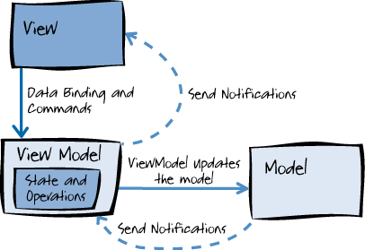

## Vuejs

### 특징

- MVVM 패턴: Model - View - ViewModel
    + 애플리케이션 로직과 UI의 분리를 위해 설계된 패턴
- ViewModel은 View의 실제 논리 및 데이터 흐름을 담당
- View는 ViewModel만 알고 있으면 되며 비즈니스 로직에선는 ViewModel의 상태 데이터만 변경하면 즉시 View에 반영
- 가상 DOM을 지원하므로 아주 빠른 UI 렌더링 속도를 제공

### 기본 디렉티브

- v-model: 양방향 바인딩
- v-text: innerText 속성에 연결됨
- v-html: innerHTML 속성에 연결됨
- v-bind: 요소(Element) 객체의 속성들을 바인딩하기 위해 사용
- v-show vs v-if
    + v-if: 조건에 부합되지 않으면 렌더링을 하지 않음
    + v-show: 일단 HTML 요소를 렌더링한 후에 display 스타일 속성으로 화면에 보여줄지 여부를 결정(display:none)
    + 자주 화면이 변경되는 부분에서는 v-show를 사용하는 것이 바람직
- v-for: 반복적인 데이터 렌더링
    + v-if와 함께 사용할 수 있음. 주의할 점은 v-for가 먼저 수행되고 v-if가 수행됨

### 계산형 속성(Computed Property) vs 메서드

- 계산형 속성은 종속된 값에 의해 결괏값이 캐싱이 됨 하지만, 메서드는 호출 되는 대로 매번 수행

### 관찰 속성(Watched Property)

- 긴 시간이 필요한 비동기 처리가 필요할 때 유용(웬만하면 사용하지 않아도 됨)

### Vue 인스턴스 라이프 사이클

- beforeCreate: Vue 인스턴스가 생성되고 데이터에 대한 관찰 기능 및 이벤트 감시자 설정 전에 호출
- create: Vue 인스턴스가 생성된 후에 데이터에 대한 관찰 기능, 계산형 속성, 메서드, 감시자 설정이 완료된 후에 호출
- beforeMount: 마운트가 시작되기 전에 호출
- mounted: el에 vue 인스턴스의 데이터가 마운트된 후에 호출
- beforeUpdate
    + 가상 DOM이 렌더링, 패치도기 전에 데이터가 변경될 때 호출
    + 이 훅에서 추가적인 상태 변경을 수행할 수 있음
    + 하지만 추가로 다시 렌더링하지 않음
- updated
    + 데이터의 변경으로 가상 DOM이 다시 렌더링되고 패치된 후에 호출
    + 이 훅이 호출되었을 때는 이미 컴포넌트의 DOM이 업데이트된 상태
    + DOM에 종속성이 있는 연산을 이 단계에서 수행할 수 있음
- beforeDestroy: Vue 인스턴스가 제거되기 전에 호출
- destroyed
    + Vue 인스턴스가 제거된 후에 호출
    + 이 훅이 호출될 때는 Vue 인스턴스의 모든 디렉티브의 바인딩이 해제되고, 이벤트 연결도 모두 제거

### 컴포넌트 조합

- 속성(Props)을 통해 자식 컴포넌트로 정보를 전달할 수 있음. 부모 → 자식
- 자식 컴포넌트는 부모 컴포넌트로 이벤트 발신
    + 자식에 사용자 정의 이벤트를 정의하고 이벤트를 발생시키면 부모에서 이벤트 핸들러 메서드를 호출하도록 작성
- 컴포넌트 기반으로 개발할 때 data 옵션은 각 컴포넌트의 로컬 상태를 관리하기 위한 용도로만 사용
- 컴포넌트에서 data 옵션은 함수로 작성하고 함수 내부에서 객체를 리턴하도록 작성

### Webpack

- 모던 자바스크립트 애플리케이션 개발을 위한 모듈 번들러
- 모듈과 모듈이 사용하는 정적 자원(CSS, Image)들을 묶어서 하나의 파일 또는 몇 개의 파일로 번들링

#### Webpack 구성

- Entry
    + 처음 로드하는 파일을 지정
    + 단일 파일 또는 여러 개의 파일을 지정 가능
    + 단일 파일일 때는 문자열로 파일의 경로를 지정하고, 여러 개의 파일일 경우 객체 형태로 지정
