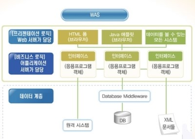
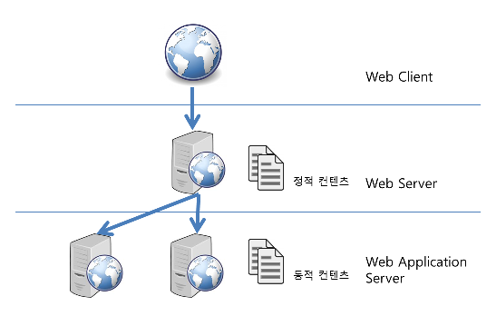

## WAS vs Web Server

### 웹 서버(Web Server)

- 웹 서버(소프트웨어): 웹 브라우저 클라이언트로부터 HTTP요청을 받아들이고, HTML문서와 같은 웹 페이지에서 흔히 찾아 볼 수 있는 자료 컨텐츠에 따라 HTTP에 반응하는 컴퓨터 프로그램
- 웹 서버(하드웨어): 위에 언급한 기능을 제공하는 컴퓨터 프로그램을 실행하는 컴퓨터
- HTML 문서같은 정적 컨텐츠를 처리하는 것(HTTP 프로토콜을 통해 읽힐 수 있는 문서)

### 웹 어플리케이션 서버(WAS, Web Application Server)

- HTTP를 통해 컴퓨터나 장치에 어플리케이션을 수행해주는 미들웨어(소프트웨어 엔진)이다.
- 동적 서버 컨텐츠를 수행한다는 것이 웹 서버와 구별되며, 주로 데이터베이스 서버와 같이 수행됨
- asp, php, jsp 등 개발 언어를 읽고 처리하여 동적 컨텐츠, 웹 응용 프로그램 서비스를 처리하는 것

### 참고사이트

- [WEB 서버, WAS 서버](https://okky.kr/article/243427)
